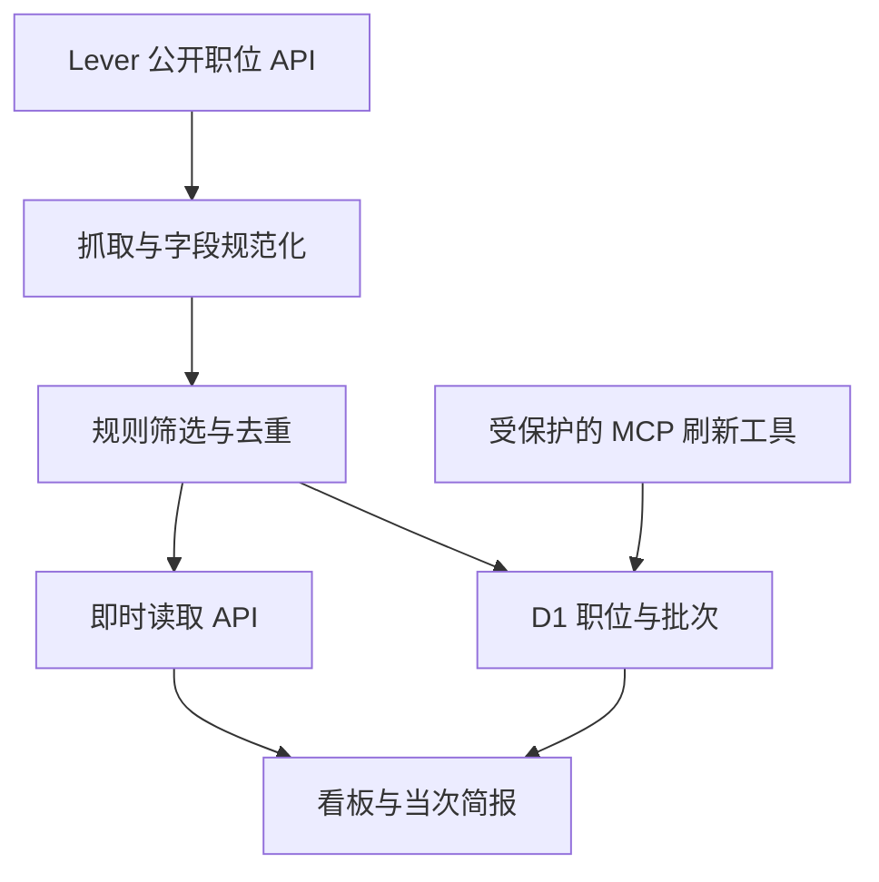

# AI Job Radar · 上海招聘情报助手

从公司公开招聘页读取上海岗位，规范化、去重、评估学历与经验门槛，展示可追溯的职位看板与当次简报。面向求职者的可运行作品演示，不自动投递或声称职位符合申请资格。

**在线演示：** https://ai-job-radar.violet-panda-6449.chatgpt.site

## 已实现

- 从 Yuno、Xsolla、WGSN、dLocal 的 Lever 公开职位 API 获取当前上海岗位；页面显示来源健康状态、原职位链接与读取时间。
- 统一职位、公司、地点、团队、发布时间、薪酬（仅在来源公开时）、描述及技能字段。以来源和职位 ID 去重。
- 规则检测明确的学历、工作年限门槛；未写明条件标为“待核实”，不能冒充“确认符合”。“优先核实”也要求求职者回原页面确认。
- 技能与初级岗位信号计算参考分，支持关键词搜索、资格状态筛选、依据展开。
- 生成当次招聘简报，统计岗位、公司、高频技能。D1 数据库记录职位与抓取批次，成功来源的下线职位设为非活跃；失败来源不清除旧记录。
- 公开看板可按“抓取最新”临时读取实时来源；受保护的 MCP 工具可触发持久化更新。

## 技术栈与架构

TypeScript、React 19、Next.js/Vinext、Cloudflare Workers、D1 (SQLite)、Drizzle 迁移、Lever Postings API、ESLint。界面使用 Shadcn 组件与 Lucide 图标。



核心代码：`lib/radar.ts` 负责抓取与规则；`lib/store.ts` 负责 D1 的 upsert、下线与批次；`app/api/radar/route.ts` 对看板提供快照或即时读取；`app/mcp/route.ts` 提供受保护的持久化刷新；`app/page.tsx` 是求职看板；`db/schema.ts` 与 `drizzle/` 定义迁移。

## 本地运行

需要 Node.js >= 22.13、pnpm 11。克隆仓库后：

```bash
pnpm install
pnpm db:generate
pnpm dev
```

打开终端输出的本地地址。首次无 D1 快照时，`GET /api/radar` 自动回退到即时公开来源；`GET /api/radar?live=1` 始终即时读取，不写数据库。本地持久化需要按 `.openai/hosting.json` 配置 D1 绑定并应用 `drizzle/0000_dapper_darwin.sql`。部署在 Sites 时由托管 D1 提供绑定。验证：

```bash
pnpm lint
pnpm build
```

## 数据与规则说明

当前仅覆盖四家公司 Lever 招聘页的**主工作地点含上海**的职位，不代表全上海招聘市场。职位随来源变化；薪资与学历/经验信息可能缺失。分数是启发式排序，检测到学历或年限词时归为“存在明确门槛”，未明确写清则为“待核实”，仅同时存在低学历和无需经验友好表述时归为“可优先核实”。简单关键词可能误判否定句、任职要求和加分项；必须打开原职位核实。职位首次收录时间与原发布日期分别保存，不把旧岗位算作“今日新增”。

默认看板优先显示最近一次持久化批次；如尚无批次则现场读取。点击“抓取最新”会更新当前浏览器所见的实时结果，**不会写入 D1**。后台持久化刷新可通过站点所有者身份调用 `refresh_job_radar` MCP 工具，写入批次及历史；它不是已配置的无人值守定时任务。公开页面不会开放匿名写入。来源请求失败时页面给出状态或错误，不伪造岗位。

## 下一步

- 在验证站点身份、来源可用性和后台写权限后，接入定时任务自动运行持久化刷新，增加每日新增、下线趋势和真正的历史日报。
- 增加可授权的更多招聘来源、地区与搜索条件；遵守来源条款、请求频率与公开访问范围。
- 使用 LLM 从原文提取结构化学历/经验要求，并给出证据片段与不确定性；人工复核后再纳入匹配。
- 将个人简历与项目文档切片并建立向量索引，以 RAG 为岗位匹配提供可引用的个人经历依据；不把职位原文混作个人事实。
- 扩展 Tool Calling：读取来源、检索历史、解释匹配依据、生成投递计划；写入与对外动作保持用户授权。

本项目为求职作品，非招聘平台官方产品。职位版权归其来源方，投递请通过原链接。
